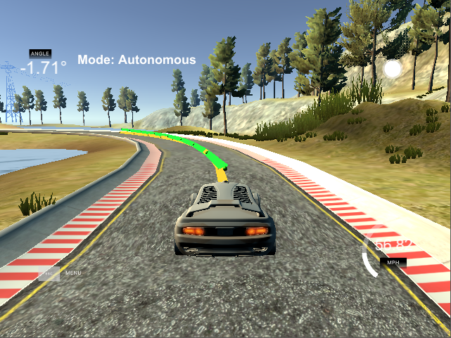
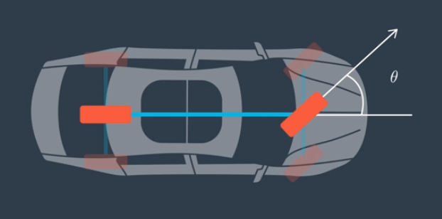
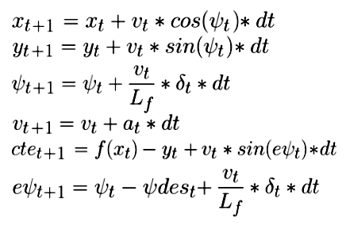
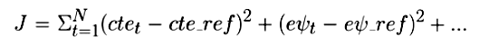
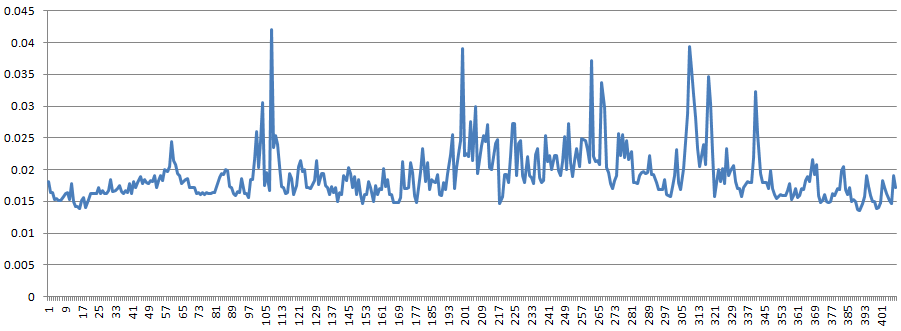
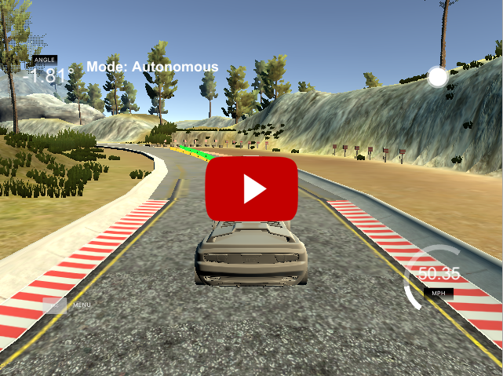
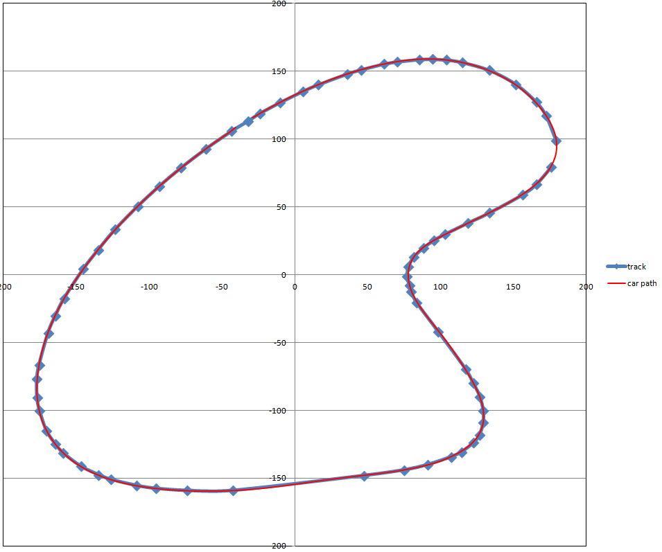

# CarND MPC Control Project
Udacity Self-Driving Car Engineer Nanodegree Program

---

## Overview

The goal of this project was to drive a car on a simulated track using the [Model Predictive Control](https://en.wikipedia.org/wiki/Model_predictive_control) (MPC) algorithm. The controller calculates steering and throttle values based on reference waypoints and the state of the car (position, speed, heading and actuator values). The finished C++ code uses the [Ipopt](https://projects.coin-or.org/Ipopt) optimizer and [CppAD](https://www.coin-or.org/CppAD/) automatic differentiation libraries.

In this screenshot the **yellow line** illustrates the preferred path based on waypoints. The **green line** shows the path calculated by the MPC controller, using a model based on the steering angle and acceleration actuators while minimizing cross track error (cte).



---

## Model

### State

The controller receives the following information from the simulator:

* **px, py** - the current position of the car
* **𝜓 (psi)** - the heading of the car
* **v** - speed of the car
* **wp0x, wp0y, ... wp5x, wp5y** - x and y positions of the next six waypoints, in world space
* **steering_angle** - current steering angle, in range of [-25°..25°]
* **throttle** - current throttle position, in range of [-1..1]

The waypoints are first transformed from world space to car space and a third degree polynomial is fitted across them.

Using the polynomial, the following error values are calculated:

* **CTE (cross track error)** - distance from preferred track
* **ePsi** - difference of orientation

The resulting state vector has six variables:

* **x** - x position in car space (0)
* **y** - y position in car space (0)
* **𝜓** - orientation in car space (0)
* **v** - velocity
* **cte** - cross track error
* **e𝜓 (epsi)** - orientation error

### Actuators

The car is controlled by two actuators:

* **𝛿 (steering angle)** - in the range of [-25°..25°]
* **a (accelerator)** - in the range of [-1..1] where -1 is full brake, 1 is full acceleration

### Update Equations

Our kinetic model is based on the bicycle model to simplify calculations. The bicycle model replaces the rear axle into one unsteered wheel at the centerline of the car, and the front axle with one steered wheel on the same centerline.



The following update equations are used:



Where **Lf** is the distance of the steering axle from car's center of gravity.

The cost function used by the optimizer is in the form:



The cost function is a weighted sum of the these error terms:

* **cte** - distance from preferred path
* **epsi** - difference in orientation
* **reference velocity** - difference from target speed
* **steering** - stay on track with minimum steering value
* **accelerator** - efficient use of throttle/brake
* **steering change** - to avoid sharp change in steering
* **accelerator change** - to avoid sharp change in acceleration and braking

Each term has a weight associated to it. The highest weights are assigned to **cte**, **epsi** and **steering change** to ensure driving close to the preferred path, while keeping steering input smoot.

---

## Optimizer Parameters

The solver uses **N** time steps with **dt** duration between steps to optimize the actuator controls (steering/accelerator) while minimizing the cost function.

The solving step is very processor intensive task. Time spent by the solver can be reduced by using less time steps (**N**), however setting the time steps too low will result in suboptimal actuator inputs, possibly even crashing the car.

The duration per step value, in conjunction with the number of steps, defines how far ahead the path is planned. The optimum value sets the look ahead so that the car can react to the path with comfortable actuator inputs, while making sure that sharp changes in the path are not ignored due to long time steps.

To determine the best values, data is collected from every time step and written into a CSV file. The data was analyzed in Excel (included data.xlsx file).

| N        | dt           | cte average  | speed average | solver time average |
| ------------- |:-------------:| -----:| -----:| -----:|
| 10 | 0.12 | 0.096 | 50.05 | 0.019 |
| 8 | 0.12 | 0.189 | 49.33 | 0.015 |
| 14 | 0.12 | 0.086 | 52.25 | 0.031 |
| 10 | 0.8 | 0.147 | 56.31 | 0.017 |
| 10 | 0.16 | 0.005 | 45.00 | 0.020 |

After analyzing the data, I chose **N=10** and **dt=0.12** for the best combination of low cte and solver time, while achieving a good speed around the track.


---

## Latency

In a real life car there are actuator latencies. To simulate latency, our program implements a 100ms delay.

The MPC solver also takes some time. The time used by the solver is measured in the code and the recorded value is smoothed over time using [linear interpolation](https://en.wikipedia.org/wiki/Linear_interpolation). The solver latency varies frame to frame as shown in the graph below, recorded over one lap:



The latencies are added up to get the total latency:

* **total_latency** = actuator_latency + solver_time

To handle latency, the car's position and orientation is projected forward based on it's current speed, heading and steering angle using the bicycle model:

* px' = px + total_latency \* v \* cos(psi);
* py' = py + total_latency \* v \* sin(psi);
* psi' = psi - total_latency \* v \* steering_angle / Lf;

The solver then uses this projected state of the car to optimize actuator values from.

NOTE: The simulator should also have some latency for rendering the frame, but I couldn't find a way to measure it and the simulation was working well on my system.

---

## Result

A recording of the car driving:

[](https://youtu.be/Yug0_oQ10k0 "MPC Controller")

The car drives around the track at an average speed of 50mph and reaches a maximum speed of 74mph. It correctly speeds up in straightaways and slows down for turns.

This graph shows the predefined waypoints and preferred path in blue, while the actual recorded path of the car in red:



---

## Dependencies

* cmake >= 3.5
 * All OSes: [click here for installation instructions](https://cmake.org/install/)
* make >= 4.1(mac, linux), 3.81(Windows)
  * Linux: make is installed by default on most Linux distros
  * Mac: [install Xcode command line tools to get make](https://developer.apple.com/xcode/features/)
  * Windows: [Click here for installation instructions](http://gnuwin32.sourceforge.net/packages/make.htm)
* gcc/g++ >= 5.4
  * Linux: gcc / g++ is installed by default on most Linux distros
  * Mac: same deal as make - [install Xcode command line tools]((https://developer.apple.com/xcode/features/)
  * Windows: recommend using [MinGW](http://www.mingw.org/)
* [uWebSockets](https://github.com/uWebSockets/uWebSockets)
  * Run either `install-mac.sh` or `install-ubuntu.sh`.
  * If you install from source, checkout to commit `e94b6e1`, i.e.
    ```
    git clone https://github.com/uWebSockets/uWebSockets
    cd uWebSockets
    git checkout e94b6e1
    ```
    Some function signatures have changed in v0.14.x. See [this PR](https://github.com/udacity/CarND-MPC-Project/pull/3) for more details.

* **Ipopt and CppAD:** Please refer to [this document](https://github.com/udacity/CarND-MPC-Project/blob/master/install_Ipopt_CppAD.md) for installation instructions.
* [Eigen](http://eigen.tuxfamily.org/index.php?title=Main_Page). This is already part of the repo so you shouldn't have to worry about it.
* Simulator. You can download these from the [releases tab](https://github.com/udacity/self-driving-car-sim/releases).
* Not a dependency but read the [DATA.md](./DATA.md) for a description of the data sent back from the simulator.


## Basic Build Instructions

1. Clone this repo.
2. Make a build directory: `mkdir build && cd build`
3. Compile: `cmake .. && make`
4. Run it: `./mpc`.

## Tips

1. It's recommended to test the MPC on basic examples to see if your implementation behaves as desired. One possible example
is the vehicle starting offset of a straight line (reference). If the MPC implementation is correct, after some number of timesteps
(not too many) it should find and track the reference line.
2. The `lake_track_waypoints.csv` file has the waypoints of the lake track. You could use this to fit polynomials and points and see of how well your model tracks curve. NOTE: This file might be not completely in sync with the simulator so your solution should NOT depend on it.
3. For visualization this C++ [matplotlib wrapper](https://github.com/lava/matplotlib-cpp) could be helpful.)
4.  Tips for setting up your environment are available [here](https://classroom.udacity.com/nanodegrees/nd013/parts/40f38239-66b6-46ec-ae68-03afd8a601c8/modules/0949fca6-b379-42af-a919-ee50aa304e6a/lessons/f758c44c-5e40-4e01-93b5-1a82aa4e044f/concepts/23d376c7-0195-4276-bdf0-e02f1f3c665d)
5. **VM Latency:** Some students have reported differences in behavior using VM's ostensibly a result of latency.  Please let us know if issues arise as a result of a VM environment.

## Editor Settings

We've purposefully kept editor configuration files out of this repo in order to
keep it as simple and environment agnostic as possible. However, we recommend
using the following settings:

* indent using spaces
* set tab width to 2 spaces (keeps the matrices in source code aligned)

## Code Style

Please (do your best to) stick to [Google's C++ style guide](https://google.github.io/styleguide/cppguide.html).

## Project Instructions and Rubric

Note: regardless of the changes you make, your project must be buildable using
cmake and make!

More information is only accessible by people who are already enrolled in Term 2
of CarND. If you are enrolled, see [the project page](https://classroom.udacity.com/nanodegrees/nd013/parts/40f38239-66b6-46ec-ae68-03afd8a601c8/modules/f1820894-8322-4bb3-81aa-b26b3c6dcbaf/lessons/b1ff3be0-c904-438e-aad3-2b5379f0e0c3/concepts/1a2255a0-e23c-44cf-8d41-39b8a3c8264a)
for instructions and the project rubric.

## Hints!

* You don't have to follow this directory structure, but if you do, your work
  will span all of the .cpp files here. Keep an eye out for TODOs.

## Call for IDE Profiles Pull Requests

Help your fellow students!

We decided to create Makefiles with cmake to keep this project as platform
agnostic as possible. Similarly, we omitted IDE profiles in order to we ensure
that students don't feel pressured to use one IDE or another.

However! I'd love to help people get up and running with their IDEs of choice.
If you've created a profile for an IDE that you think other students would
appreciate, we'd love to have you add the requisite profile files and
instructions to ide_profiles/. For example if you wanted to add a VS Code
profile, you'd add:

* /ide_profiles/vscode/.vscode
* /ide_profiles/vscode/README.md

The README should explain what the profile does, how to take advantage of it,
and how to install it.

Frankly, I've never been involved in a project with multiple IDE profiles
before. I believe the best way to handle this would be to keep them out of the
repo root to avoid clutter. My expectation is that most profiles will include
instructions to copy files to a new location to get picked up by the IDE, but
that's just a guess.

One last note here: regardless of the IDE used, every submitted project must
still be compilable with cmake and make./

## How to write a README
A well written README file can enhance your project and portfolio.  Develop your abilities to create professional README files by completing [this free course](https://www.udacity.com/course/writing-readmes--ud777).
